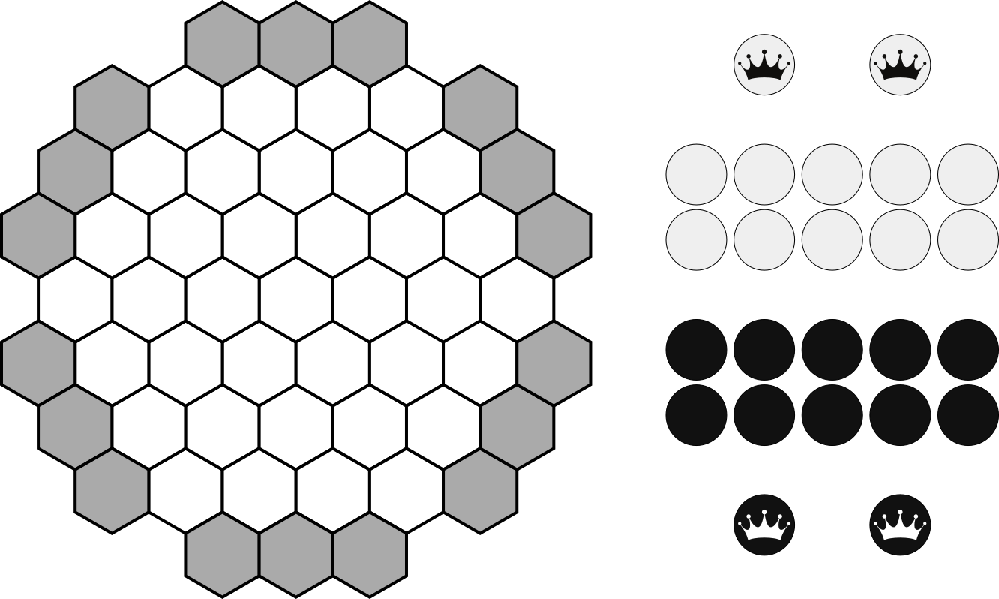
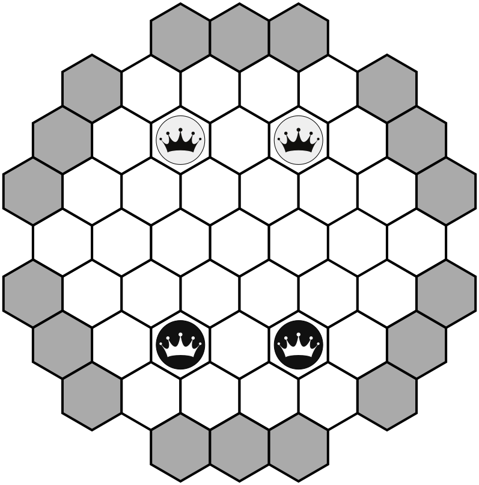

# Ikenga
* Abstract strategy
* 2 players
* 20 minutes
## Introduction
In the Igbo language, ikenga literally means _strength of movement_. In this game, both players compete against each other to be the first one to captute both of their opponent's queens.
## Components

* 1 game board
* 20 stones (10 white, 10 black)
* 4 queens (2 white, 2 black)
## Setup
Place the game board in between the players. Each player chooses the color to play with. Place each players' queens in the designated spaces as shown in the image below. White moves first.

## How to play
### Actions
In their turn, a player can take one of four actions:
#### Place a new stone
#### Move a stone
#### Slide a stone in play
#### Move a warrior

### Capture
Warriors are captured by surrounding them on two sides.
## End of the game
