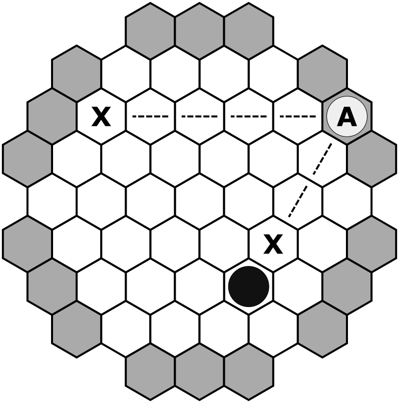

# March of the fire ants
* Abstract strategy
* 2 players
* 20 minutes
## Introduction
In **March of the fire ants**, two players compete to be the first one to captute both of their opponent's queens.
## Components

* 1 game board
* 20 stones (10 white, 10 black)
* 4 queens (2 white, 2 black)
## Setup
Place the game board in between the players. Each player chooses the color to play with. Place each players' queens in the designated spaces as shown in the image below, and all 10 stones close to them. These stones are their reserve. White moves first.

## Definitions

* **Reserve**: The stones close to a player, still not played on the board.
* **Buffer space**: Each of the 18 dark gray hexes on the board. Pieces can only be placed in buffer spaces when brough from the reserve or from another buffer space.
* **Regular space**: Each of the 37 white hexes on the board.

## How to play
### Actions
On their turn, players take one of the following actions:
* **Place a new stone**: Bring a stone from the reserve to an unoccupied buffer space.
* **Change buffer space**: Move a stone in a buffer space to another, unoccupied one.
* **Move a stone**: Move a stone from a buffer space or a regular space according to the stones' rules of movement.
* **Move a queen**: Move a queen on a regular space according to the queens' rules of movement.

### Rules of movement

#### Stones
Stones move in a straight line across the edges of the hexes, moving as far as possible. A stone's movement only stops when the next space is occupied by another piece or queen, or there are no more regular spaces to move to.

The following figure shows all possible moves for stone A, which would finish its movement in any of the spaces marked with an X.

The figure below shows all possible moves for stone A which, starting from a buffer space, could finish its movement in any of the spaces marked with an X.

### Queens

Queens also move in a straight line across the edges of the hexes. Unlike stones, queens are allowed to finish their movement on any regular space along the line of movement. The figure below shows all possible destination spaces for queen A marked with an X. 

### Capture
A queen is captured when at least one of the following two conditions is met:
* Two pieces (regardless of whether they are queens or stones) of the opposed color surronds two of the queens' sides in a straight line (the queen is "sandwiched"). A queen moving in between two opponent pieces does not cause the queen to be caputed. Pieces surrounding a queen must be placed in regular spaces (i.e. pieces in buffer spaces are not taken into account when determining if a queen is captured) In the figure below, piece A moves and captures tue black queen.

* A queen is left with no empty regular spaces surrounding it. In this case, it does not matter the color of the pieces surrounding the queen. In the following figure, both the white and the black queens are surrounded and captured.

When a queen is captured, the piece is flipped and returned to the owner's reserve as a **regular stone**.

## End of the game

The game ends when the two queens of one of the players are captured. The player with queens remaining on the board is the winner.
